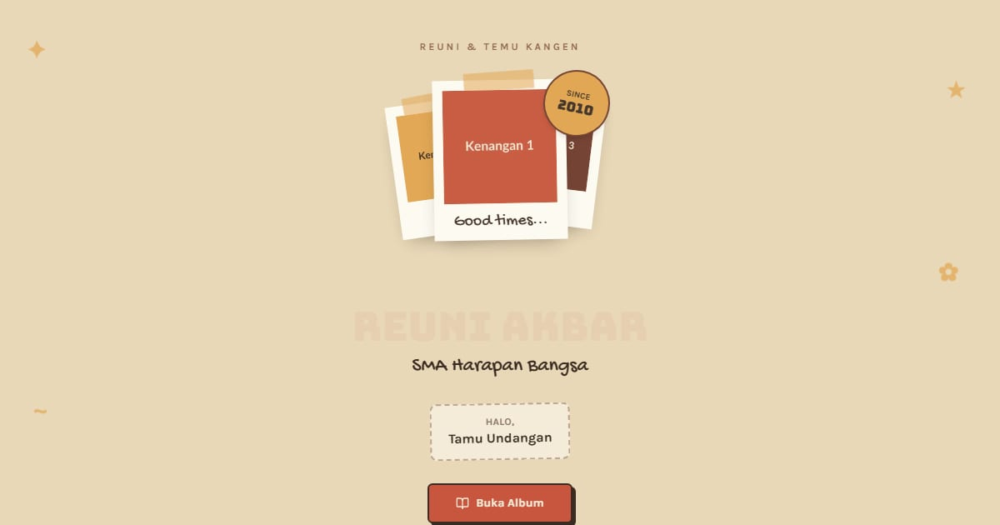

# Undangan Digital — Reuni (Yearbook / Scrapbook Retro)

**Demo live:** https://undangan-reuni-livid.vercel.app



> Undangan contoh dengan data fiktif. Formulir RSVP hanya demo dan tidak mengirim data.

Konsep **album kenangan / scrapbook retro** — nostalgia angkatan:

- **ScrapbookCover** — sampul album + tumpukan polaroid, tombol *Buka Album*
- **Hero** — banner reuni retro (font Bungee), angkatan & sekolah
- **EventNote** — detail acara sebagai catatan tertempel (selotip) + add to calendar
- **CountdownTimer** — kotak miring "kumpul lagi dalam..."
- **Throwback** — timeline kilas balik angkatan
- **PolaroidGallery** — foto bergaya **polaroid bertaburan** (bingkai + selotip + caption tulisan tangan) + lightbox
- **Attendees** — komponen tanda tangan: **dinding "Sudah Hadir"**; form RSVP langsung **menempel nama** ke tembok + hitung jumlah
- **MapEmbed**, **Memories** (bagikan kenangan/sticky note), **Footer**

Komponen **`Polaroid`** reusable. Tema **terakota–mustard** + tekstur kertas tua, font **Bungee + Gochi Hand + Karla**. Responsif terverifikasi (320/375/768px).

## Menjalankan
```bash
npm install && npm run dev
```
Semua konten di **`lib/data.js`** (objek `reunion`, `throwback`, `gallery` polaroid, `attendees`).

---

Bagian dari koleksi 8 undangan digital di [PortalUndangan](https://portal-undangan-eta.vercel.app). Dibuat oleh [PintuWeb](https://pintuweb.com), jasa pembuatan website.
